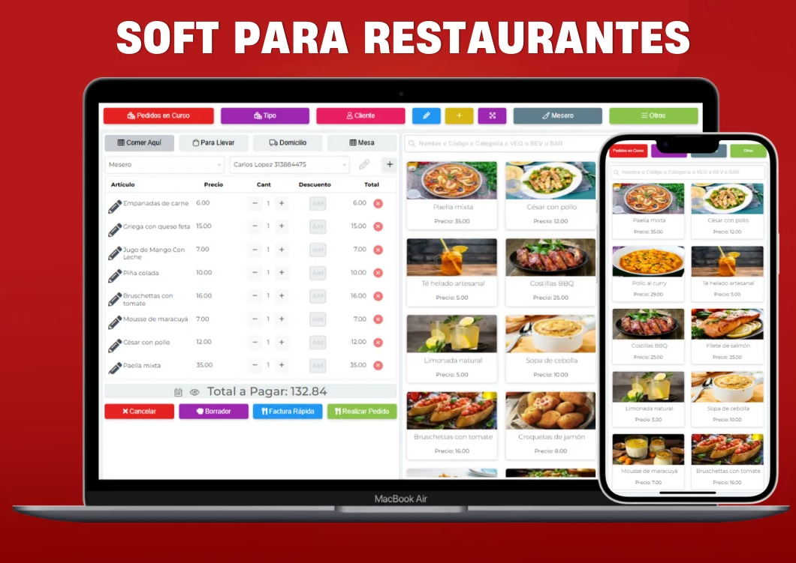
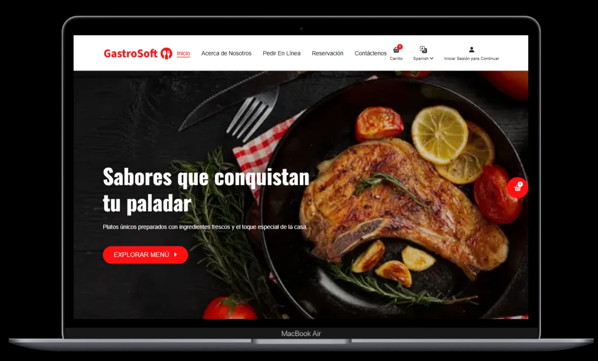
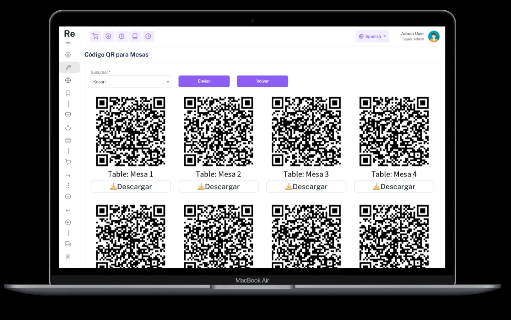
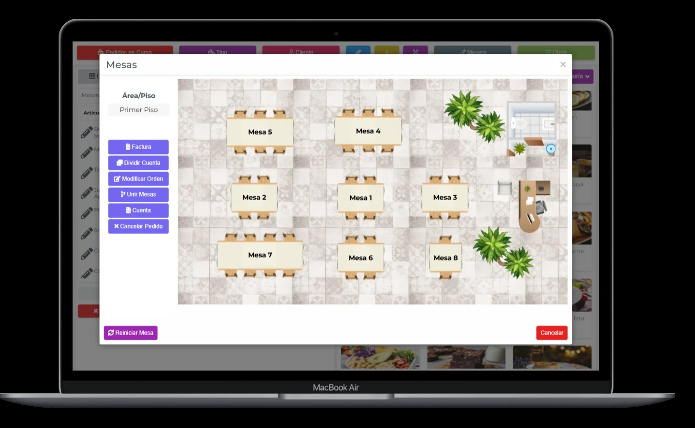
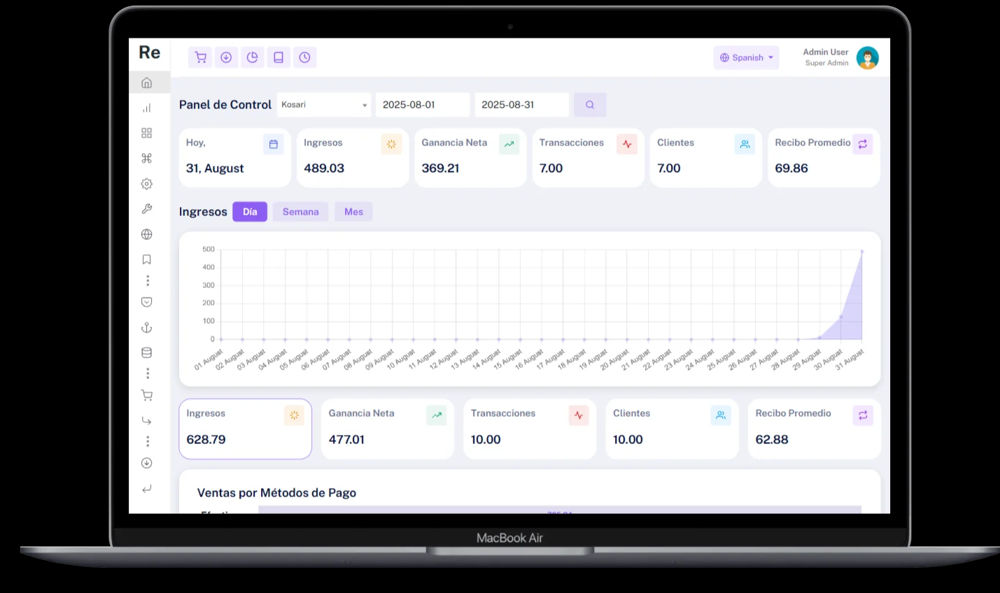
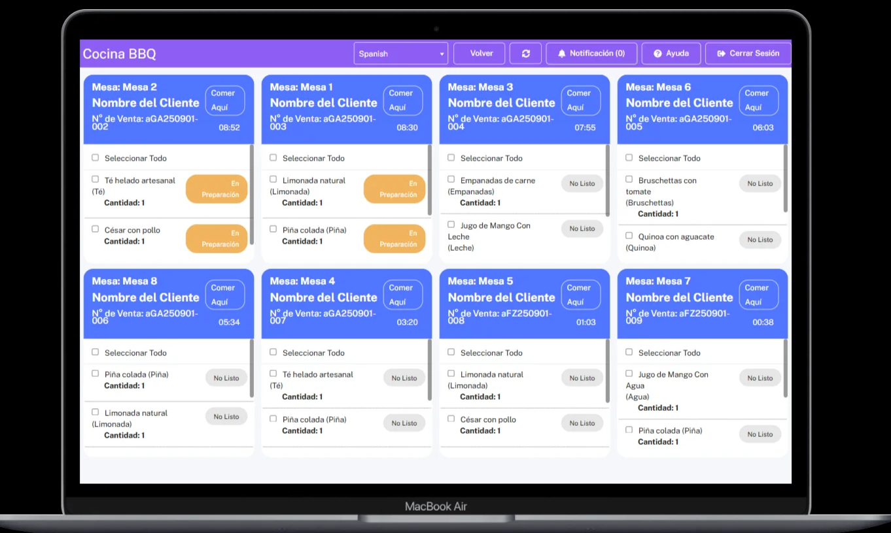
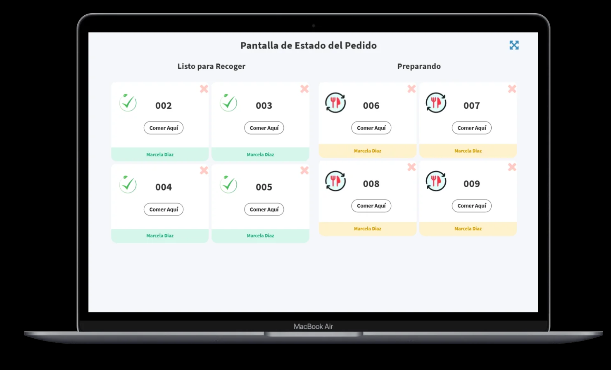

CANTOSOFT (Gastrosoft)
=================================
Sistema de gestión gastronómica (POS + Backoffice + Web Ordering + KDS + KOT) desarrollado en PHP (CodeIgniter 3) y MySQL/MariaDB.

Estado: estable para entornos on‑premise o cloud
Stack recomendado: Apache + PHP 7.2–7.4 + MySQL/MariaDB
Integraciones opcionales: Stripe (pagos), Twilio (notificaciones)
Licencia: MIT (o la que definas)

---------------------------------
TABLA DE CONTENIDOS
---------------------------------
1. Características del sistema
2. Arquitectura
3. Requisitos
4. Instalación
   4.1 Windows (XAMPP)
   4.2 Linux (Apache + PHP + MySQL)
   4.3 Docker (opcional)
5. Configuración
   5.1 Base URL y .htaccess
   5.2 Base de datos
   5.3 Variables de entorno (Stripe/Twilio)
6. Uso rápido
7. Estructura del proyecto
8. Seguridad
9. Resolución de problemas
10. Convenciones y contribución
11. Roadmap
12. Créditos y contacto

---------------------------------
1) CARACTERÍSTICAS DEL SISTEMA
---------------------------------
SITIO WEB FRONTEND
- Listado y búsqueda de menús; clasificación por categoría
- Carrito de compras y lista de deseos
- Página de detalle con toppings, modificadores y notas de preparación
- Pago en línea (Stripe)
- Entrega a domicilio, recolección en tienda, entrega sin contacto
- Perfil de cliente

PEDIDOS EN LÍNEA
- Pedido desde el sitio web
- Modos: Entrega, Recolección, Consumo en local
- Seguimiento del estado del pedido en tiempo real

AUTO-PEDIDO CON CÓDIGO QR (SIN CONTACTO)
- Escaneo de QR para ordenar en mesa
- Modos: Cenar en casa, Para llevar, Entrega a domicilio
- Pagos mediante QR

RESERVAS EN LÍNEA
- Reservas desde la web
- Configuración de mesas y confirmación automática

RECETAS Y COSTEO
- Gestión de recetas, cálculo de costo por ingredientes
- Reporte automático de ganancias

KOT (Kitchen Order Tickets)
- Impresión de tickets por categoría y soporte de múltiples impresoras

KDS (Kitchen Display System)
- Pantalla de cocina por categoría
- Estado en tiempo real, notificaciones, priorización de órdenes

PAGOS
- Compatible con prepago y pospago
- Soporte para múltiples métodos

PLANO DEL RESTAURANTE
- Diseño visual de mesas, gestión de meseros, estado de ocupación

VARIACIONES, TOPPINGS Y MODIFICADORES
- Tamaños, sabores y opciones personalizadas

PROMOCIONES / DESCUENTOS / COMBOS
- Descuentos por porcentaje o monto fijo
- Promociones configurables; combos con precios especiales

FIDELIZACIÓN
- Puntos por compras y canje por descuentos

MULTIIDIOMA
- Soporte multilenguaje

IMPUESTOS
- Impuestos configurables y reglas por ubicación

POS (PUNTO DE VENTA)
- Multiusuario; órdenes rápidas (Dine-in, Delivery, Takeaway)
- Impuestos, descuentos, impresión de recibos
- Gestión de categorías y menús
- Roles y permisos
- Apertura y cierre de caja
- Multisucursal

PANTALLA DE ESTADO DE PEDIDO
- Seguimiento en vivo para clientes y cocina

CANCELACIÓN Y AUDITORÍA
- Registro de cancelaciones y eliminaciones

INFORMES
- Ventas, Caja, Pedidos, Impuestos, Descuentos, Clientes
- Resumen de ganancias
- Informe Z

MARCA BLANCA
- Logo propio y dominio propio

--------------------
2) ARQUITECTURA
--------------------
Frontend: vistas CodeIgniter (HTML/CSS/JS)
Backend: PHP 7.x + CodeIgniter 3 (MVC)
Base de datos: MySQL/MariaDB
Servidor: Apache con mod_rewrite
Integraciones: Stripe y Twilio mediante variables de entorno
KOT/KDS/Impresoras: por categorías y múltiples dispositivos

----------------
3) REQUISITOS
----------------
- PHP 7.2–7.4 (recomendado para CodeIgniter 3)
  Extensiones: mysqli, mbstring, curl, gd, openssl, intl, json
- Apache con mod_rewrite habilitado
- MySQL o MariaDB
- Composer (opcional, para SDKs Stripe/Twilio)
- Git (para despliegue/actualizaciones)

-----------------
4) INSTALACIÓN
-----------------

4.1 WINDOWS (XAMPP)
1. Instalar XAMPP y levantar Apache + MySQL.
2. Clonar el proyecto en C:\xampp\htdocs\CANTOSOFT
   git clone https://github.com/ajoca/CANTOSOFT.git CANTOSOFT
3. (Opcional) Composer:
   cd CANTOSOFT
   composer install --no-dev
4. Crear BD en http://localhost/phpmyadmin (p.ej. cantos_db).
5. Configurar ver sección 5) CONFIGURACIÓN.
6. Abrir http://localhost/CANTOSOFT/

4.2 LINUX (APACHE + PHP + MYSQL)
- Instalar paquetes: apache2, libapache2-mod-php, php, php-mysql, php-mbstring, php-curl, php-gd, php-xml, php-intl, git
- Clonar en /var/www y ajustar permisos para www-data
- Habilitar mod_rewrite y VirtualHost con AllowOverride All
- Crear BD (cantos_db), configurar app, reiniciar/reload Apache

4.3 DOCKER (OPCIONAL)
Ejemplo mínimo docker-compose.yml:
- Servicio web: php:7.4-apache con extensiones mysqli, mbstring, gd, intl
- Servicio DB: mariadb:10.6 con MYSQL_DATABASE=cantos_db
- Variables de entorno STRIPE_*/TWILIO_* en el servicio web
- Publicar puerto 8080:80
Abrir http://localhost:8080/

-----------------
5) CONFIGURACIÓN
-----------------

5.1 BASE URL Y .HTACCESS
- application/config/config.php
  $config['base_url'] = 'http://localhost/CANTOSOFT/'
- Asegurar AllowOverride All y mod_rewrite activo en Apache

5.2 BASE DE DATOS (application/config/database.php)
$db['default'] = array(
  'dsn'      => '',
  'hostname' => 'localhost',
  'username' => 'root',
  'password' => '',
  'database' => 'cantos_db',
  'dbdriver' => 'mysqli',
  'pconnect' => FALSE,
  'db_debug' => (ENVIRONMENT !== 'production'),
  'char_set' => 'utf8',
  'dbcollat' => 'utf8_general_ci',
);

Sugerencia: versionar database.example.php y NO subir database.php real.

5.3 VARIABLES DE ENTORNO (STRIPE/TWILIO)
application/config/stripe.php
  $config['stripe_secret']   = getenv('STRIPE_SECRET') ?: '';
  $config['stripe_public']   = getenv('STRIPE_PUBLIC') ?: '';
  $config['stripe_currency'] = 'usd';

application/config/twilio.php
  $config['twilio_sid']   = getenv('TWILIO_SID')   ?: '';
  $config['twilio_token'] = getenv('TWILIO_TOKEN') ?: '';
  $config['twilio_from']  = getenv('TWILIO_FROM')  ?: '';

Definición en Apache (.htaccess o VirtualHost):
  SetEnv STRIPE_SECRET sk_test_xxxxxxxxx
  SetEnv STRIPE_PUBLIC pk_test_xxxxxxxxx
  SetEnv TWILIO_SID ACxxxxxxxxxxxxxxxxxxxxxxxxxxxxxxxx
  SetEnv TWILIO_TOKEN xxxxxxxxxxxxxxxxxxxxxxxxxxxxxxxx
  SetEnv TWILIO_FROM +598xxxxxxxx

Nunca subir claves al repositorio.

----------------
6) USO RÁPIDO
----------------
1. Crear/usar usuario administrador. Si no hay seed, ejemplo (ajustar al esquema real):
   INSERT INTO users (username, password, role, status)
   VALUES ('admin', MD5('admin123'), 'admin', 'Active');
2. Configurar sucursales, mesas e impuestos.
3. Cargar categorías, menús, recetas/ingredientes y stock inicial.
4. Operar POS (Dine-in/Delivery/Takeaway), imprimir KOT y usar KDS.
5. Consultar reportes (ventas, caja, Z, etc.).

-----------------------------
7) ESTRUCTURA DEL PROYECTO
-----------------------------
CANTOSOFT/
  index.php
  .htaccess
  application/
    config/          (base_url, database, rutas, stripe.php, twilio.php)
    controllers/     (POS, Menú, Inventario, Reportes, etc.)
    models/
    views/
    logs/            (ignorado)
    cache/           (ignorado)
  assets/            (CSS/JS/imagenes)
  vendor/            (si se usa Composer)

--------------
8) SEGURIDAD
--------------
- No subir database.php ni claves Stripe/Twilio; usar variables de entorno.
- Rotar claves si alguna vez se expusieron.
- Configurar encryption_key en config.php para producción.
- Forzar HTTPS en servidores públicos.
- Restringir acceso directo a /application/* desde el servidor web.

---------------------------
9) RESOLUCIÓN DE PROBLEMAS
---------------------------
- Pantalla blanca / 500:
  Establecer ENVIRONMENT = 'development' en index.php y revisar application/logs.
- 404 / URLs rotas:
  Falta mod_rewrite o AllowOverride All en Apache.
- Error de base de datos:
  Revisar credenciales/host/puertos en database.php y permisos del usuario DB.
- Stripe/Twilio sin funcionar:
  Verificar getenv('STRIPE_SECRET') / getenv('TWILIO_SID') devuelve valores.
- PHP 8.x:
  Usar PHP 7.4 para máxima compatibilidad con CodeIgniter 3.

-----------------------------------
10) CONVENCIONES Y CONTRIBUCIÓN
-----------------------------------
- Commits: Conventional Commits (feat:, fix:, chore:, docs:, refactor:, test:).
- Ramas: main estable; PRs desde feature/* con descripción y pasos de prueba.
- Estilo: PSR-12 sugerido; revisar linters/formatters si se agregan.

-----------
11) ROADMAP
-----------
- Composerizar SDKs (Stripe/Twilio) 100%
- Exportaciones CSV/XLSX en reportes
- Test suite (PHPUnit)
- Modo multi-tenant (SaaS)
- Analytics en dashboard

-----------------------
12) CRÉDITOS Y CONTACTO
-----------------------
Autor/Mantención: ajoca
Repo: https://github.com/ajoca/CANTOSOFT
Issues y soporte: abrir un Issue con versión de PHP/SO, logs y pasos de reproducción.

Notas finales:
- Este repo debe estar sanitizado: sin secretos ni dumps pesados de instalación.
- Si se requiere un dump de DB de ejemplo, publicarlo como release adjunto o mantenerlo fuera del repo.
---------------------------------
13) CAPTURAS DE PANTALLA
---------------------------------
## 📸 Capturas de pantalla

